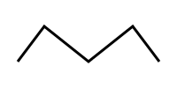
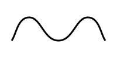
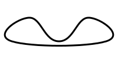

<h1 align="center">Bezier Curve Extension</h1>

<p align="center">
    <a href="https://github.com/jiaming743/BezierCurve/blob/master/LICENSE"> </a>
    <a href="https://www.npmjs.com/package/@jiaminghi/bezier-curve"> </a>
</p>

### This plugin provides three extension methods for Bezier curves.

- **[bezierCurveToPolyline](#bezierCurveToPolyline)**

  Ability to abstract a Bezier curve into a polyline consisting of N **uniformly distributed** points.

- **[getBezierCurveLength](#getBezierCurveLength)**

  Get the length of bezier curve.

- **[polylineToBezierCurve](#polylineToBezierCurve)**

  Abstracting a polyline consisting of N points into a Bezier curve.

### Install with npm

```shell
$ npm install @jiaminghi/bezier-curve
```

------

<h3 align="center">Examples</h3>

#### bezierCurve

```javascript
// Bezier curve data structure
const bezierCurve = [
    // Start point
	[20, 20],
    // Multiple sets of bezier curve
    [
        // controlPoint1,controlPoint2,endPoint
        [100, 20],[100, 80],[180,80]
    ],
    // [...],[...]
]
```

<p align="center">
    
</p>

<p align="center"><i>bezierCurve</i> in <b>SVG</b></p>

#### bezierCurveToPolyline

```javascript
/**
 * @description Get the polyline corresponding to the Bezier curve
 * @param {Array} bezierCurve BezierCurve data
 * @param {Number} precision  Calculation accuracy. Recommended for 5-10. Default = 5
 * @return {Array} Point data that constitutes a polyline after calculation
 */
function bezierCurveToPolyline (bezierCurve, precision = 5) {
  // ...
}

const precision = 5

const polyline = bezierCurveToPolyline(bezierCurve, precision)
// polyline = [
// [[20,20],
// [25.998752507628243,20.11632023466343],[31.698106846035834,20.457189096242345],
// [37.11424670004552,21.010468821119716],[42.263355754480024,21.764021645678454],
// ...]
```

<p align="center">
    
</p>

<p align="center"><i>polyline</i> in <b>SVG</b></p>

#### Notice

- The calculation result of *bezierCurveToPolyline* consists of N points, and N depends on the precision you set.
- Recommended precision is 5-10.
- If the setting precision is less than 1 or too large, the calculation result may be abnormal.
- Sometimes it is **impossible** to achieve precision.


#### getBezierCurveLength

```js
/**
 * @description Get the polyline corresponding to the Bezier curve
 * @param {Array} bezierCurve bezierCurve data
 * @param {Number} precision  calculation accuracy. Recommended for 5-10. Default = 5
 * @return {Number} BezierCurve length
 */
export function getBezierCurveLength (bezierCurve, precision = 5) {
  // ...
}

// Normally the default precision can achieve better visual effects.
const length = bezierCurveToPolyline(bezierCurve)
```


#### polyline

```javascript
// polyline data structure
const polyline = [
    [20, 70],
    [50, 30],
    [100, 70],
    [150, 30],
    [180, 70]
]
```

<p align="center">
    
</p>

<p align="center"><i>polyline</i> in <b>SVG</b></p>


#### polylineToBezierCurve

```javascript
/**
 * @description Abstract the polyline formed by N points into a set of bezier curve
 * @param {Array} polyline A set of points that make up a polyline
 * @param {Boolean} close  Closed curve
 * @param {Number} offsetA Smoothness
 * @param {Number} offsetB Smoothness
 * @return {Array} A set of bezier curve
 */
function polylineToBezierCurve (polyline, close = false, offsetA = 0.25, offsetB = 0.25) {
	// ...
}

const bezierCurve = polylineToBezierCurve(polyline)
// bezierCurve = [
// [
// 	[20,70],
// 	[[27.5,60],[30,30],[50,30]],
// 	[[70,30],[75,70],[100,70]],
// 	[[125,70],[130,30],[150,30]],
// 	[[170,30],[172.5,60],[180,70]]]
//]

const closedBezierCurve = polylineToBezierCurve(polyline, true)
// closedBezerCurve = [
// 	[20,70],
// 	[[-12.5,60],[30,30],[50,30]],
// 	[[70,30],[75,70],[100,70]],
// 	[[125,70],[130,30],[150,30]],
// 	[[170,30],[212.5,60],[180,70]],
// 	[[147.5,80],[52.5,80],[20,70]]
// ]
```

<p align="center">
    
</p>

<p align="center"><i>bezierCurve</i> in <b>SVG</b></p>

<p align="center">
    
</p>

<p align="center"><i>closedBezierCurve</i> in <b>SVG</b></p>

